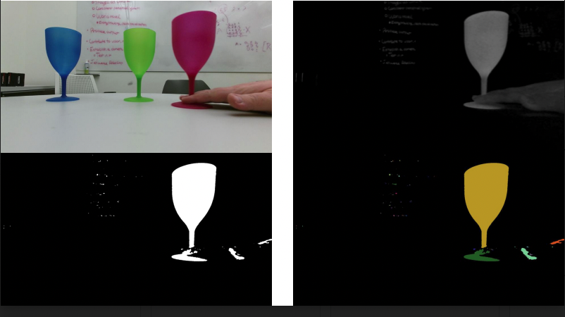

# color-blob
image segmentation using OpenCV and RViz

frame by frame playback of an image, four part segmentation, color subtraction, binary thresholding, mask, then image segmentation of single cup. 

